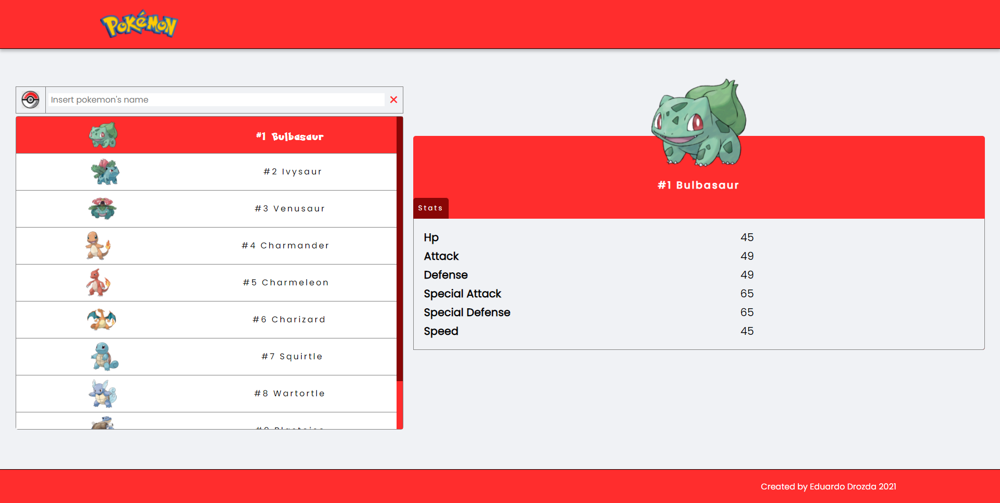
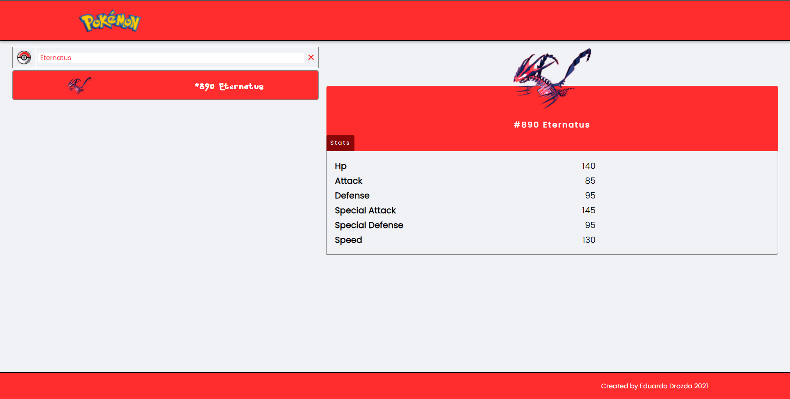
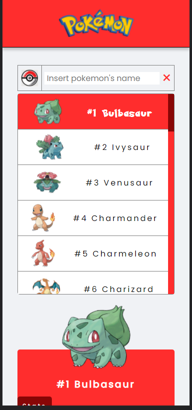

# Ng Pokedex

This project is intended to improve my knowledge of the Angular framework and its entire ecosystem (Sass, Css, Control Value Accessor, Directives, etc.).

## TO DO

- ✔️ Integration with poke api.
- ✔️ Pokemon List with infinite scroll.
- ✔️ Search pokemons by name.
- ✔️ Show pokemon base stats.
- ❌ Show more information about pokemons.
- - ❌ Moves
- - ❌ Evolutions
- ❌ Show more informations about berries, 
- ❌ Show more information about games.
- ❌ Unit tests.
- ❌ Github pipes.

## Architecture 
```
ng-pokedex
├─ .browserslistrc
├─ .editorconfig
├─ .gitignore
├─ angular.json
├─ karma.conf.js
├─ package-lock.json
├─ package.json
├─ README.md
├─ src
│  ├─ app
│  │  ├─ app-routing.module.ts
│  │  ├─ app.component.html
│  │  ├─ app.component.scss
│  │  ├─ app.component.spec.ts
│  │  ├─ app.component.ts
│  │  ├─ app.module.ts
│  │  ├─ pages
│  │  │  └─ pokemons
│  │  │     ├─ components
│  │  │     │  ├─ pokemon-detail
│  │  │     │  │  ├─ pokemon-detail.component.html
│  │  │     │  │  ├─ pokemon-detail.component.scss
│  │  │     │  │  ├─ pokemon-detail.component.spec.ts
│  │  │     │  │  └─ pokemon-detail.component.ts
│  │  │     │  └─ pokemons-list
│  │  │     │     ├─ pokemons-list.component.html
│  │  │     │     ├─ pokemons-list.component.scss
│  │  │     │     ├─ pokemons-list.component.spec.ts
│  │  │     │     └─ pokemons-list.component.ts
│  │  │     ├─ models
│  │  │     │  ├─ index.ts
│  │  │     │  └─ pokemon.ts
│  │  │     ├─ pokemons.component.html
│  │  │     ├─ pokemons.component.scss
│  │  │     ├─ pokemons.component.spec.ts
│  │  │     ├─ pokemons.component.ts
│  │  │     ├─ pokemons.module.ts
│  │  │     └─ services
│  │  │        ├─ pokemons.service.spec.ts
│  │  │        └─ pokemons.service.ts
│  │  └─ shared
│  │     ├─ components
│  │     │  ├─ footer
│  │     │  │  ├─ footer.component.html
│  │     │  │  ├─ footer.component.scss
│  │     │  │  ├─ footer.component.spec.ts
│  │     │  │  └─ footer.component.ts
│  │     │  ├─ header
│  │     │  │  ├─ header.component.html
│  │     │  │  ├─ header.component.scss
│  │     │  │  ├─ header.component.spec.ts
│  │     │  │  └─ header.component.ts
│  │     │  ├─ input
│  │     │  │  ├─ input.component.html
│  │     │  │  ├─ input.component.scss
│  │     │  │  ├─ input.component.spec.ts
│  │     │  │  └─ input.component.ts
│  │     │  └─ loader
│  │     │     ├─ loader.component.html
│  │     │     ├─ loader.component.scss
│  │     │     ├─ loader.component.spec.ts
│  │     │     └─ loader.component.ts
│  │     ├─ directives
│  │     │  └─ infinite-scroll
│  │     │     ├─ infinite-scroll.directive.spec.ts
│  │     │     └─ infinite-scroll.directive.ts
│  │     ├─ interceptors
│  │     │  ├─ index.ts
│  │     │  └─ request.intercetor.ts
│  │     ├─ models
│  │     │  ├─ index.ts
│  │     │  └─ pagination.ts
│  │     ├─ services
│  │     ├─ tokens
│  │     │  ├─ apiUrl.token.ts
│  │     │  └─ index.ts
│  │     └─ utils
│  │        ├─ AnimationsUtils.ts
│  │        ├─ index.ts
│  │        └─ PokemonUtils.ts
│  ├─ assets
│  │  ├─ .gitkeep
│  │  ├─ img
│  │  │  └─ png
│  │  │     ├─ logo.png
│  │  │     └─ pokeball.png
│  │  └─ scss
│  │     ├─ breakpoints.scss
│  │     ├─ fonts.scss
│  │     ├─ mixins.scss
│  │     ├─ style.scss
│  │     └─ theme.scss
│  ├─ environments
│  │  ├─ environment.prod.ts
│  │  └─ environment.ts
│  ├─ favicon.ico
│  ├─ index.html
│  ├─ main.ts
│  ├─ polyfills.ts
│  ├─ styles.scss
│  └─ test.ts
├─ tsconfig.app.json
├─ tsconfig.json
├─ tsconfig.spec.json
└─ yarn.lock
```

## Preview

### Desktop





### Mobile


